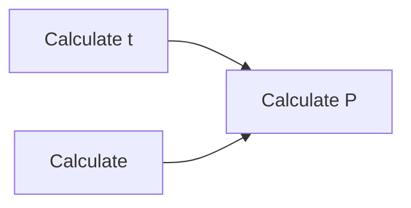

## Two Sample t-test

### Optimization

1. moving mean; instead of re-calculate the mean every time a new sample comes in
2. Moving std; instead of re-calculate the std every time a new sample comes in

