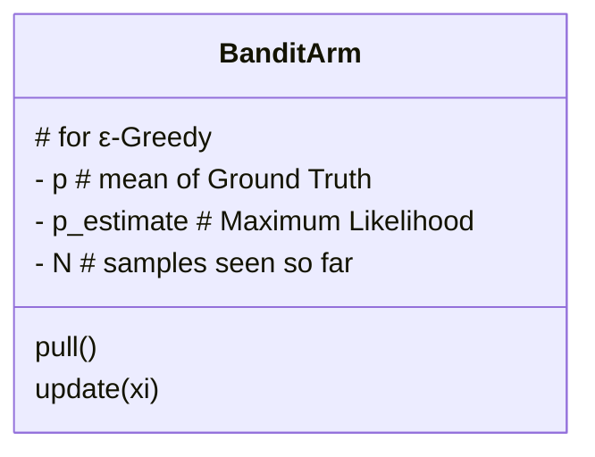

# MAB -- Bayesian AB Testing

## Explore-Exploit Dilemma


#### Why Against Greey on the maximum likelihood estimate of win rate now?


##### Effect size

- it's related to the difference btw the win-rate of the two slot machines


- Algs can be used in place of a traditional AB test in software system
- Methods that overcome some of the awkard problems like effect size, wanting to stop my experiment early and the controversial P-value.
- **Adaptive**, meaning that they learn on the fly, ∴ advantageous, especialy in high throughput online business settings.


### Applications


##### Gaussian vs. Bernoulli


## 1 -- ε-Greedy

- to Balance exploration and exploitation
- Short-sighted
- use only immediately available info as a heuristic


- once we have X, we can update the estimate for the mean of the bandit we selected.

##### Additional Details

- Want to collect each data abou each bandit!
  - ∵ want estimate of win-rate to be accurate
- But at 
  - What point shouldwe stop exploring ? 
  - What happens if we let the algorithm run forever?
    - if not stop exploring, ==> total collective reward will be suboptimal...
- By definition, if one of the bandits is optimal, then the other bandits are not optimal.


#### Decaying Epsilon


### Calculating a Sample Mean


###### If the values of the RV can only be 0or 1, thenthesample mean is exactly the MLE of the Bernoulli param


#### Rolling mean


#### Constant Time & Space for Sample Mean estimation


### Exercise


### Designing My Bandint Program


==> Also pattern to be followed for My Bandit Prog.


### My Code's Result


### Cmp Diff ε w/ Reward in Real Value as  ~ N(μ, σ**2)

- I have
  1. BanditArm class
  2. run_exp()
  3. print & plot()
- Changes:
  - pull()
    - as reward distribution has changed from Bernoulli to Gaussian
    - 
  - plt.xscale('log') 's REASON
    - Alg. will converge so fast, so it's difficult to truly see the differences btw each value of EPSILON./
    - Using a log scale allows me to zoom-in to the relevant parts of the plot.
  - Return the cumulative average reward from this functin so that in the main section, I'll can plot the cumulative averages for DIFFERENT values of EPSILON in the same plot.

- No Changes:
  - Update()
    - Since same way I calc the sample mean
  - run_experiment()

- My main()
  - 3 bandits w/ diff means: 1.5, 2.5, and 3.5
  - ε I'll try: 0.1, 0.05, 0.01
  - 100,000 trials for each experiment
  - 


### For Real Data & Online Learning

- The hypothesis tests work on static datasets (a data file).

  ​					↑  →←  ↓

- Epsilon-greedy works in real-time systems adapting to users who enter data into the system at different times. It's not a static data file.

- Bandit Summary, Real Data, and Online Learning

- Adaptive Ad service for the Streaming


## 2 -- Optimistic Initial Values


#### Pseudocode


- it's an overestimate of the true mean


### Choosing Bandit


- even for the optimal one,we can't expect it to have a good estimate of the true mean, because the ini value could have so **HIGH**, and the number of trials **so LOW enough** that the estimted mean is an overestimate by the end of the experiment


### Init value meaning


### Exercise


 

### MyCode


- No gap btw final cumulative rewards rate and the true optimal win rate, which is 0.75

```zsh
mean estimate: 0.5454545454545454
mean estimate: 0.5958904109589042
mean estimate: 0.753300832825516
total reward earned: 7495.0
overall win rate: 0.7495
num times selected each bandit: [11.0, 146.0, 9846.0]
```

- For optimal bandit, the estimated mean will probably slowly climb down from the initial value, down to 0.75 eventually.
  - So if we start at 5, it's going to go down from 5 to 0.75
- For other suboptimal bandits, they are going to stop being selected if they go anywhere below 0.75, since we're being **greedy**, ∴ no chance to converget to true means
  - stop getting updated...
- suboptimal 沒怎麼被選到！


### Sum:

- make the mean estimation artificially high, so that ech bandit gets chosen more often until we learn the true mean is not that actually high


## 3 -- UCB1 

- Each of the ideas take the prev idea and makes it a little more complex!

##### OIV :

- make the mean estimation artificially high, so that ech bandit gets chosen more often until we learn the true mean is not that actually high

##### UCB1

- use the Prob. to infer a upper bound!


###### Sum 

The prob of being larger than a large Error is smaller; 

The prob of being larger than a smaller Error is larger

##### Q: What's the prob that my Error is bigger than some T?


1. sample mean on bandit-j
2. **error upper bound**! Like the optimistic initial values method, except that
   instead of using an optimistic estimate for the mean, we use the actual sample mean, plus some upper bound on the error
3. JUST think of it as using the upper bound on the confidence interval as intuition
4. Still greedy wrt the upper bound!


### CI Intuition


1. Case #1:
   - Haven't collected a lot of samples yet
   - estimate is bad; CI is large!  ==> I want to explore this bandit, so that I can collect more samples
   - Using  upper bound of the confidence interval would be useful since it would be very high, and if I take the bandit with the maximum upper bound, then I can explore this bandit
2. Case #2:
   - data Ok, so my estimate is very accurate and I no longer need to explore this bandit
   - The only way I can explore this bandit is if it's true mean is actually high and is higher than the upper bound on the other bandits
3. Upper bound of a confidence interval allows me to explore and exploit in a reasonable way!


### EE in UCB1


- 2 : merely heuristic


### Why does it work?


### Code & Result!

```python
import numpy as np
import matplotlib.pyplot as plt

NUM_TRIALS = 100000
EPS = 0.1
BANDIT_PROBABILITIES = [0.2, 0.5, 0.75]

np.random.seed(1)

class Bandit:
    def __init__(self, p):
        # p: the win rate
        self.p = p
        self.p_estimate = 0.
        self.N = 0.  # num samples collected so far

    def pull(self):
        # draw a 1 with probability p
        return np.random.random() < self.p

    def update(self, x):
        self.N += 1.
        self.p_estimate = ((self.N - 1) * self.p_estimate + x) / self.N


def ucb(mean, n, nj):  # TODO
    return mean + np.sqrt(2 * np.log(n) / nj)


def run_experiment():
    bandits = [Bandit(p) for p in BANDIT_PROBABILITIES]
    rewards = np.empty(NUM_TRIALS)
    total_plays = 0

    # initialization: play each bandit once
    for j in range(len(bandits)):
        x = bandits[j].pull()
        total_plays += 1
        bandits[j].update(x)

    for i in range(NUM_TRIALS):
        # j = # TODO
        # j = np.argmax([ucb(b.p_estimate, i, b.N) for b in bandits])
        j = np.argmax([ucb(b.p_estimate, total_plays, b.N) for b in bandits])
        x = bandits[j].pull()
        total_plays += 1
        bandits[j].update(x)

        # for the plot
        rewards[i] = x
    cumulative_average = np.cumsum(rewards) / (np.arange(NUM_TRIALS) + 1)

    # plot moving average ctr
    plt.plot(cumulative_average)
    plt.plot(np.ones(NUM_TRIALS) * np.max(BANDIT_PROBABILITIES))
    plt.xscale('log')
    plt.show()

    # plot moving average ctr linear
    plt.plot(cumulative_average)
    plt.plot(np.ones(NUM_TRIALS) * np.max(BANDIT_PROBABILITIES))
    plt.show()

    for b in bandits:
        print(b.p_estimate)

    print("total reward earned:", rewards.sum())
    print("overall win rate:", rewards.sum() / NUM_TRIALS)
    print("num times selected each bandit:", [b.N for b in bandits])

    return cumulative_average


if __name__ == '__main__':
    run_experiment()

```


## 4 -- Bayesian Bandits / Thompson Sampling Theory

digression

#### CI as tool for nice picture


- 代表true mean的可能在的地方，就是分布


### Bayes Rule


### Why Proportionality?


### Conjugate Pairs/Priors

- In general, the posterior doesn't fit nicely into one of these common distributions
  - E.g. I can't say if my likelihood is a Gaussian AND my prior as a uniform, then my posterior will be a Gaussian, that ==> WON'T WORK
- However, Conjugate Priors is SPECIAL,
  - The posterior comes from the same kind of distribution as the prior
  - If prior is a Gaussian, then. ==> posteriror will also be a Gaussian
  - This is contingent on the fact that my likelihood matches the prior such that they are conjugate!


##### Bernoulli Conjugate Prior

##### BETA <== Bernoulli * BETA(α, β)


### Choosing a Prior

- How to choose value of  α  &  β?


## 4 -- Bayesian Bandits (Cont.)


- This posterior represents our belief about the distribution of theta, the mean of a bandit
  - Theta could be anywhere in this range, although obviously the areas with more probability mass are more probable.


-  By drawing samples from this distribution, we're saying give me a value from this distribution and let that determine which bandit I choose.
  - Instead of just using one value, which is the upper bound, I use all of its values, **according to the posterior distribution,** by drawing samples
  - As I sraw more and more samples, this distribution will become skinner and skinner as I get more confident in my belief of where the true mean lies


### Pseudocode


- Be greedy, but with respect to samples from the posteriors rather than some statistic estimated from the samples


### Graphs of the Posteriors!

#### Scene 1


- In addition, its peak moves up a bit, since getting a one increase the mean


#### Scene 2


#### Demo Plot!


### Sum


- Intuitive idea: I'm interested in something like the CI of win-rate estimate
  - This perfectly encapsulates the EE dilemma. 
    - When CI is fat --> Explore!
    - When CI is small --> Exploite this fact, by choosing the bandit with the highest mean, which we are now confident about.
  - BUT! CI is based on the CLT, and don't portray the true distribution of the bandit win-rates
  -  Instead, the Bayesian treats the win-rate as a RV! which is to give it it's own distribution!
    - In general, computing a posterior from Bayes rule is not easy, because they usually involve intractable sums or unsolvable integrals
    - ★!!!★ SO, I use Conjugate Prior's to show that, instead of calculating the posterior by hand, we can instead use proportionality to prove that the shape of the posterior fits some particular distribution, and from there, the normalizing constant can be found since the integral of any distribution must equal to 1.
    - NEXT, introduce the Thompson Sampling algorithm: 
      - To choose a bandit, just rank each bandit, based on samples drawn from their posteriors. 
      - Over time, this does exactly what we want!
        - When distributions are FAT --> explore more
        - When distributions are Skinny --> explore less
      - Importantly, when the optimal distribution becomes skinny, we can leave the suboptimal distributions FAT, since in this scenario, the optimal bandit is still usually has the highest sample.
        - This leads to us choosing the optimal bandit more, which is how we exploit.


### Code!

```python
  def sample(self):
    return np.random.beta(self.a, self.b)

	for i in range(NUM_TRIALS):
    # Thompson sampling
    j = np.argmax([b.sample() for b in bandits])
    # Says, give me the bandit that yields the LARGEST sample from its current beta posterior

```


- Thompson Sampling is nice because the sub-optimal bandits only get pushed down far enough so that their posteriors hav very little probability mass beyond the peak of the optimal bandit!
  - They remain FAT posterior distributions
  - This is a good thing, because bein gfat means that they haven't been explored that much!
  - And this tells us that we explored just enough to be very confident that their means are not better than the optimal bandits mean


## Thompson Sampling With Gaussian Reward Theory

* No more study this topic, leave in the future... Terrible MATH...


#### .....


#### Solving for posterior


#### Code!


## Prev

- In particular, does the P-value give us a definitive answer to our question?
- We are interested in what the drawbacks of using this type of statistical test might be?
  - important when Bayesian & AB


## Why no use a lib?


## Nonstationary Bandits


## Bandit Summary, Real Data, & Online Learning


## Alternative Bandit Designs

### 





# My Youtube Surveys


https://www.youtube.com/watch?v=aWKeSvnTalE&feature=youtu.be

#### ε-Greedy's Issue 

spends equal amount of time exploring arms it knows are not optimal!


#### https://www.youtube.com/watch?v=wcCSAbcj5Q0


#### https://www.youtube.com/watch?v=o6HBIGzQfJs


