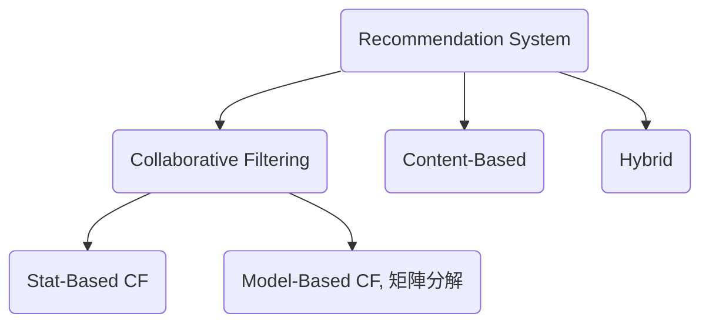
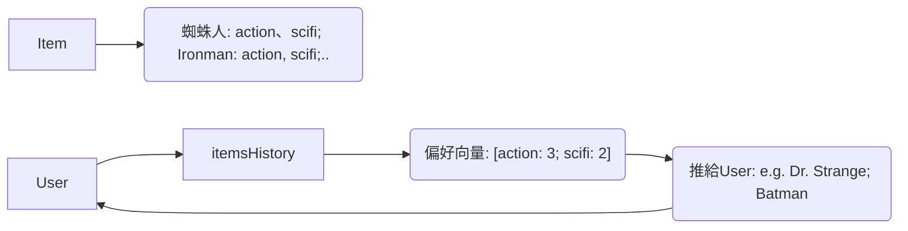
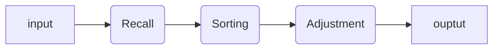

根據用戶的歷史info & 行為，作推薦他感興趣的內容

# Recommendation System




## Behaviour-based

主要指的是Collaborative Filtering，我的好友、或是跟我做過一樣事的人也喜歡什麼，就推薦過去，例子是電影

另外可用的是用戶聚類推薦


## Content-based

w/ tag，如我做過某些事的標籤，如電影的科幻類別，如python，就可能是big data



- 優: 不需其他user data

- 缺: 需人工tagging、侷限在自己世界難挖出「潛在興趣」、cool start

- Flow

  ```mermaid
  graph LR
  	A["內容獲取<br>ID, title, intro"]  
  	B["中文分詞-提取關鍵詞<br>tool: jieba"]
  	C["Word2Vec<br>tools: Tencent's or Spark's"]	
  	D["Doc2Vec<br>with 加權平均"]
  	E["TopK近鄰搜索<br>scipy's cosine distance<br>LSH局部敏感哈希"]
  	F["redis<br>item- > list<item>"]
  	G["Flask/Java Web<br>根據item返回列表"]
  	A --> B --> C
  	B --> D
  	C --> D
  	D --> E
  	E --> F
  	F --> G

​			jieba: 基於tf-idf


## The Solution to Problems 

解決的問題？

1. 信息過載：商品、視頻等有好幾百萬
   - 用戶：怎樣找到自己感興趣的物品？
   - 系統：怎樣展示幾百萬的物品給用戶，達到自己的商業目標？

2. 挖掘長尾 The Long Tail Module：
   - 大部分的冷門物品得不到暴露，然而他們的加和價值超過熱門物品
   - 亞馬遜圖書分類57%的收入來自長尾冷門的書籍

3. 用戶體驗：

   - 搜索：當明確自己的目標的時候，我們用搜索引擎

   - 推薦：當不明確的時候，推薦系統推薦我們感興趣的商品

     一個系統推薦了我很感興趣，但是自己很難發現的物品

     想一想逛京東、亞馬遜，買了自己不需要物品


### Steps



##### Recall

從億下沉到萬級別，從海量得到少量的內容

Quick -- 50ms ~ 300ms

- CF
- Content-based
- Graph
- Hot
- New

##### Sorting (by prob. )

- Binary
  - LR
  - GBDT
  - DNN
  - Wide&Deep (Ggl's)

##### Adjustment

- de-dup
  - Bought
  - Off-line
- Hot 補足
- Pagination，提一段id呈現出
- Merge id w/ other features

##### 


## Recall paths

推薦系統中的r2i、u2i、u22iu2u2i、u2tag2是什麼意思？

基準邊們

- I2I

  如從一篇文章到一篇相似的文章

  算法如下，

  - 內容相似 (兩篇標題相似的文章)、
  - 協同過濾或關聯規則挖掘等

- U2I

  來源於用戶的直接行為，比如從用戶的播放/點擊/購買等作觀察

  如點過耳機，就推你耳機

延伸邊們

- U2I2I

  基於item的協同過濾
  或先得到用戶的行為列表然後查I2I做擴展

- U2U2I

  基於用戶的協同過濾
  用戶畫像相似然後推薦
  用戶聚類推薦

- U2Tag2I

  先算出用戶的tag偏好然後匹配item列表
  如，統計戶用看過的書籍，可算出他偏好的tag向量
  然後書籍已帶tag，所以item反推往tag是有泛化性，如頭條、fb等

- U2***2I
  PersonalRank, 在游走的時候還帶著probability 

多路召回時，依算法權重作 1)粗排TopK 2)精排


# Netflix case


# CF, Collaborative Filtering

- U2U2I 和我興趣相投的人也喜歡 xxx
  ```mermaid
  graph LR
  	subgraph Users
  	U1 
  	U2 
  	U3 
  	U4
  	end
  
  	subgraph Items
  	I1 
  	I2 
  	I3 
  	I4
  	end
  	
  	U1 --> I1
  	U1 --> I2
  	U2 --> I1
  	U2 --> I2
  	U2 --> I4	
  	U4 --> I1
  	U4 --> I2	
  	U4 --> I4
  ```

  因為U2, U4都喜歡I1, 而U1也喜歡I1，所以推U2、U4喜歡的I4給I1

  - 如何找最相似的用戶？Jarccard(聯、交集，沒考慮實際的評分數字)、cosine(ok，不錯用了)、Pierrson(把缺失值用那個人有rating的平均分補上後，作cosine)
  - 問題: U1是否喜歡某樣他未rating過的item呢？從跟他相似的人中找「加權harmonoc平均」

- U2I2I 基於物品的 -- 喜歡這個物品的人也喜歡 xxx
  如大部份喜歡I2的人也都喜歡I3，所以我們覺I2跟I3有


- 矩陣分解解釋為透過 latent factor (隱含特徵)將user興趣與item特徵作關聯
- 優缺點
  - 優點
    - 解決了sparse 問題
    - 精度高於基於領域的CF以及content-based
  - 缺點
    - 推薦結果無法解釋，隱空間的維度無法與現實中的概念對應
    - 訓練費時，只能以天粒度offline training


# Word2Vec

- Tencent [https://ai.tencent.com/ailab/nlp/embedding.html](https://gitee.com/link?target=https%3A%2F%2Fai.tencent.com%2Failab%2Fnlp%2Fembedding.html)
  - [03. 使用腾讯开源Word2vec实现内容相似推荐.ipynb · peiss/ant-learn-recsys - 码云 - 开源中国 (gitee.com)](https://gitee.com/antpython/ant-learn-recsys/blob/master/03. 使用腾讯开源Word2vec实现内容相似推荐.ipynb)
- Spark Word2Vec


| 屬性/特點          | 騰訊開源的 `word2vec` 代碼                   | `gensim` 的 `word2vec` & `doc2vec`   |
| ------------------ | -------------------------------------------- | ------------------------------------ |
| **嵌入的來源**     | 使用騰訊預訓練的模型                         | 允許從頭開始或使用預訓練的模型       |
| **文檔表示**       | 單詞嵌入的平均值（忽略順序信息）             | `doc2vec`保留單詞的順序信息          |
| **易用性和擴展性** | 手動處理嵌入文件的格式，可能需要更多手動調整 | 方便的API，簡單和直觀                |
| **性能**           | 快速，尤其是在不需訓練的情況下               | 對於大型數據集或訓練模型，可能更適合 |


# Doc2Vec

`gensim` 是最受歡迎和廣泛使用的Python庫。它提供了一個很好的實現，使得建模和訓練文檔向量非常直觀。

以下是使用 `gensim` 來計算 `doc2vec` 的基本步驟：

1. **使用**：

   ```python
   pythonCopy code
   from gensim.models.doc2vec import Doc2Vec, TaggedDocument
   from nltk.tokenize import word_tokenize
   
   # 假設文檔列表如下
   documents = ["This is the first document.",
                "This document is the second document.",
                "And this is the third one.",
                "Is this the first document?"]
   
   # 使用NLTK進行基本的詞斷詞
   tagged_data = [TaggedDocument(words=word_tokenize(_d.lower()), tags=[str(i)]) for i, _d in enumerate(documents)]
   
   # 訓練模型
   model = Doc2Vec(vector_size=20, window=2, min_count=1, workers=4, epochs=100)
   model.build_vocab(tagged_data)
   model.train(tagged_data, total_examples=model.corpus_count, epochs=model.epochs)
   
   # 取得文檔的向量
   vector = model.infer_vector(word_tokenize("This is a new sentence.".lower()))
   ```

除了 `gensim`，還有其他工具和庫，如`spaCy`和`fastText`，也提供了文檔向量的功能，但`gensim`的`doc2vec`實現被廣泛認為是此領域的黃金標準。


# Cold Start

- 解決物品冷啟動
  - 方法一: 通過內容相似度計算，把新物品帶出來
  - 方法二: 抖音的多級流量池機制


# Embeddings

產出、訓練 user embedding, item embedding

- Item2Vec
- 矩陣分解
- 雙塔DNN


# CosineDistance VS FAISS

場景:

​	Embedding 的近鄰搜索是推薦系統非常重要的一種召回方式，方法有

- User * Item --> 推薦User感興趣的Items
- User * User -->  推薦User感興趣的Users
- Item * Item --> 基於Item推薦相關Items


FAISS為Facebook AI團隊開源的針對聚類和相似性搜索庫，為dense vectors提供高效相似度搜索和聚類，支持十億級別向量的搜索


| 屬性/方法    | `scipy` 的 `distance.cosine` | Facebook AI 的 `faiss`                       |
| ------------ | ---------------------------- | -------------------------------------------- |
| **效率**     | 較適合小至中型數據集         | 設計用於大規模數據和高維度向量的高效搜索     |
| **擴展性**   | 適合小型數據集               | 可輕鬆處理大規模數據（如數十萬或數百萬項目） |
| **易用性**   | 簡單、直觀                   | 提供更多配置和優化選項，有一定的學習曲線     |
| **硬件加速** | 不支持                       | 支持GPU加速                                  |

