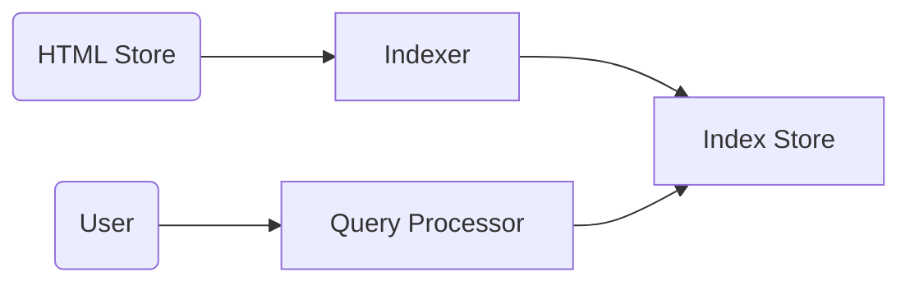

# Search

Auto-Complete不在這裡的討論


## 需求

- fn req: 
  - 通過關鍵詞快速及時找到相關info
    - 及時: 如news，時效性很強!
- Non-fn req: S, R,A, C, L, E
  - 高擴展性 -- 支持全網索引
  - 低延遲 -- 特別是for 核心網站，像是新聞網站就是最好的例子，做索引!
  - 低延遲 -- 返回給user結果
  - 高可靠性 -- 返回內容與關鍵詞相關
  - Availability -- 在線
  - 一致性 -- 還好，沒那麼要求啦
  - 效率: 返回給user結果時，需要高效的data structure & 算法 (不高效: 每次user打了字，當下找，或是未解決不同人打一樣的關鍵詞時)
- Non req:
  - 非英語 (如中文未有自然斷詞)、爬蟲、搜索結果排序(page rank) -- 把重要的放前面，狗家的安身立命之本

#### QPS 單機量級:

單機下的ram、disk、bandwidth都是影響單機的QPS量級

如果request的需求特高，QPS就會降低的

- Redis -- 只是去拿個key，所以量級很高；低的話也可以降到10~100因為處理的內容相對複雜。。 。

**==> 不好一概而論**


## 資源

- 全網 500M網站


## 系統設計圖

### 編制索引 & 查詢索引



- 例子: New York 是 連著的詞組，用戶是不會想拿 New或York單獨自己的東西


## Indexer

#### Mapper -- 給蒐

tokenization & stemming 


#### Reducer -- 拉出一串蕉

Sort()是為了讓在找交集時的算法表現比較好


### Inverted Index

##### Posting List

- 存pos的原因: 詞組 

- page ranking不考慮:還得考慮是不是大網站，詞頻是否高這類的，所以在posting list中不考慮


### MapReduce

製作詞頻是經典例子 by DFS

找詞頻也是一樣

master即使down了，也可以透過execution log on GFS recovery回來

User Program不是個服務，就只是deploy上去worker運行而已

執行一部份的task，然後master動態調整兩邊的worker工作能平衡

一個word一個reducer，但一段range是可以分配出去的

```pseudocode
// Pseudo-code for "inverted index"

```


## Q1 不能直接作inverted index

- 標點、時態、詞性、大小寫、同義詞、帶標點的詞(e.g. o'clock)、詞組(new york)、姓名、mail、stop words。
- 第二句第一個字跟第一句的尾字被接在一起了…
- 

太常見的，就去除，不要占posting list 空間

所以

- Tokenization
- Normalization
- Stemming & 


## Q2 多個單詞的搜索?

posting list 找交集


## Q3 索引實現連續的詞組搜索

- posting list放入 pos info
- 當然有些exception: N
  - 特定詞作整體index: ew York、Dr. Who


## Index Store

- Partition -- Document based or Term based?


## Q4 Posting Lit: Term-based or Document-based partition?

- Doc: posting lits are smaller, intersections are ok on one partition

- Term: only a subset of machine are used for each query


## Q5 Posting List是在RAM還是在 Hard Disk?

- 常用的放 RAM


RAM為主(Document-partitioned) + Disk為輔(Term-partitioned)


> 2-gram不對任意做，只對特定做
>
> Document-based 更平衡些
>
> Doc-based serach: 去所有機器找 word，然後合併


### Posting List 排序方案

- Doc ID
- Term Freq --> 
- Impact

後兩者難再找交集，ID就不是從小到大了，就一會大一會小，就不能在O(N)時間找到他們的交集了；但仍認為是個優化? --> 是在Document based上額外再做一份，當把範圍控得比較小，時間還是可以bounded，然後相關性也是可以增加的，就是不返回


## 索引更新

### Data structure? 

#### RAM

1. Singly Linked List
2. Variable Length Array (自動擴容) 省pointer 空間
3. Linked-List of Fixed-size Array (插得快，pointer也不會用得特別多)

#### HD

Doc Gap : 只紀錄 △

Variable Byte Encoding 


## 硬盤索引更新模式

- Rebuild -- 出來的效果就是一塊就能拿到，但每次都從0開始去重編，遇到整個internet時工作量過大
- **間斷合併 Intermittent Merge** -- 把一部份寫在ram，要滿時，就跟舊的合併，合併時會找塊連續的空間，然後就保證一次的disk seek，就是一斷時間再寫
- Incremental update -- 一有機會時，就是用戶返回時，或網站變化時，看情況更新，但可能更新hd的頻率過高，不如intermittent省工作量並省disk seek次數


## 查詢模式

- 單一關鍵詞
  - 看LRU Cache
  - 內存索引先找如果足夠多，就先返回了
    1. 智慧排序 posting list
    2. Doc ID 排序 positng list
  - HD 索引
    1. ram中尚未合併的索引
    2. 智慧排序的posing list
    3. Doc ID 排序的posting list
- 多個關鍵詞 (AND、OR) apple and iPhone
- 關鍵詞詞組 "New York", "Doctor Who", 拿兩個posting list比較position這類


## Q6 多個關鍵詞search AND使用什麼算法?

- two pointer
- **skip list** --> 低於 O(N) 完成
  - 可以時不時查看更遠的是產生在最後的表中
  - eg 跳一次後，發現新的index比表裡的index還要小，那就說明之前跳的是不用看的 --> 我覺得應該是大


## Index DB

Redis: key --> Array

#### RAM plan:

Redis-like solution: insert不好，後面大家要移；

### HD

BigTable		# TODO!

> memtable就像是一个对于DB的write-back cache
>


## APIs

#### 查詢請求

```
// Request
GET
/api/v1/
```


## 擴展性

服務器 -- 1 MapReduce

存儲 -- BigTable, Cache, Document-based Partition (& Term-based partition)


## 容災

- 服務器 -- MapReduce Persistency
  - Master、work都可fail，透過gfs裡的intermittent log file找回


## 監控警報

- Mapper/Reducer Ratio
- Index Freshness
- DB Load
- Cache Hit Rate


## Twitter Hashtag Search VS Google Search

|                 | hashtag search             | G-Search                    |
| --------------- | -------------------------- | --------------------------- |
| Inverted-Index  | only hashtagh (structured) | extract all article's words |
| Storage         | RAM                        | RAM + HD                    |
| Sorting factors | Author + retweet           | N/A                         |


## Yelp Search VS Google Search

|            | Yelp Search                                              | G-Search |
| ---------- | -------------------------------------------------------- | -------- |
| User input | Geo position + Filter(小孩、停車) + 關鍵詞(Asian Noodle) | 關鍵詞   |


# RESTful API

***REpresentational State Transfer***

1. Stateless -- 服務器不需要知道我之前問過什麼問題，每次的rest api call都是個單獨的call
2. Uniform Interface
   1. **資源為核心** -- get是get user、resource，往往是用個**名詞 而不是動詞**表述get和post的目標
   2. 資源的表現形式 -- 可以支持返回的內容是個 json、xml、txt...etc
   3. descriptive info -- API call要告訴user how to user this API. when user uses wrong, should be in "help" for User Error
   4. 允許返回 link --> 讓user 進一步發送request


##### 以資源為核心

 GET /user/123


## HTTP Method

GET, POST, PUT, DELETE


### GET

HTTP GET http://www.appdomain.com/users

##### Response

400 Bad Request

404 Not Found


### POST

##### **NOT Idempotent** --> call多次新增多個資源

HTTP POST http://www.appdomain.com/users

HTTP POST http://www.appdomain.com/users/123/accounts


##### Response

201 Created

200 OK

204 No Content -- 不该返回 該返回200


### PUT

**Idempotent** 

##### Response

Same as POST's


### DELETE 

#### 

## Q8 對於資源 /users or /user


## Q9 /users/:id/email or /email

email可以獨立user去存在嗎？不行! 所以該前者


## Q10 

// TODO


## Q11 

// TODO


